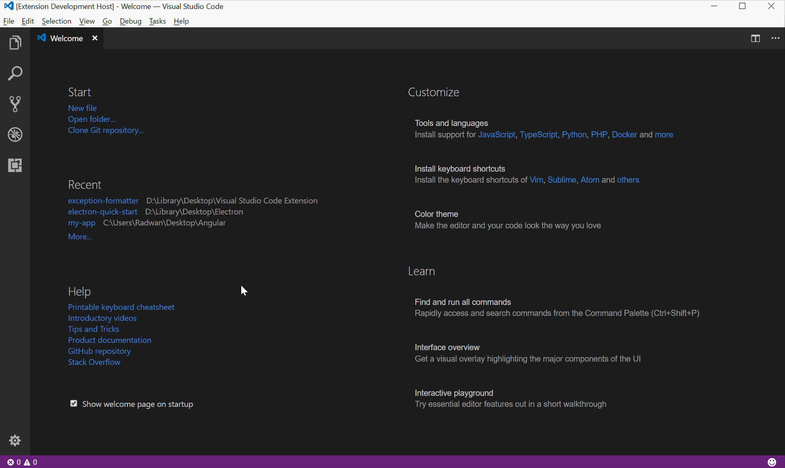

# Stack Trace Formatter

A simple extension to quickly format any C# and Java stack trace.

## Instructions

* Format an exception by pasting the text in a plaintext file, then opening up the command palette (default: `Ctrl+Shift+P`), and running the `Format Stack Trace` command.

### Demo

### 1.0.1

* Add new lines after elipses (...) and 'Caused by' to improve Java stack trace formatting.

### 1.0.0

* Initial release.
